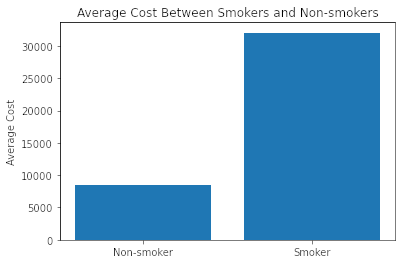

# US Medical Insurance Costs

Python portfolio project from Codecademy
Data and concept were provided by Codecademy, but all code is written by me.

This is a data analysis that reads a csv of insurance costs for 1338 people and performs a series of regressions to create a cost prediction formula

All of the analysis is in the Jupyter notebook, and it is also in [us-medical-insurance-costs.md](us-medical-insurance-costs.md) for easier viewing.

Here are the final results:

First, loaded the data into several Numpy arrays for analysis.
I then performed a simple analysis for each variable. For the regression-based variables, such as age, I ran a linear regression on the variable. For the class-based variables, such as smoker status, I found the difference between the average per status and the overall average.

__Note:__ _When using dark mode, these images may not appear properly._

After doing these individual regressions, I combined them together using the calculated weights, and I got an average error of \$4477.48, which was not great.

I then implemented gradient descent and performed multiple linear regressions on the data. This improved the error to \$4163.11.

After filtering out the outliers and performing the multiple linear regressions again, I lowered the error to \$3130.46.

Given the limited data, this is a close estimate. The costs are non-linear, as shown in the previous image, and any closer fit would overfit to the particulars of this sample. For a more accurate analysis, more information, such as previous medical history, is needed.
